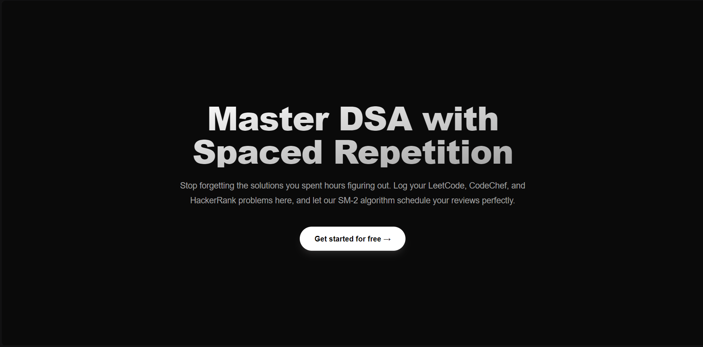

# DSA Problem Tracker

**Live Application:** [https://trackingdsa.vercel.app](https://trackingdsa.vercel.app)

A full-stack web application designed to help CS students build long-term retention of Data Structures and Algorithms (DSA) problems using **spaced repetition**. 

Every time you solve a problem on LeetCode, CodeChef, or HackerRank, you log it here and rate your confidence (1-5). An integrated SM-2 spaced repetition engine calculates exactly when you should review that problem again — drilling your weak spots and pushing your mastered problems further out.

## 🚀 Tech Stack

- **Frontend**: Next.js 15 (App Router), TypeScript, Tailwind CSS, Recharts
- **Backend**: Next.js Server Actions & API Routes, Prisma ORM
- **Database**: PostgreSQL (hosted on Supabase)
- **Authentication**: Supabase Auth

## 🎯 Features

- **Spaced Repetition Engine:** Custom SM-2 algorithm calculates next review dates based on your confidence score (1-5).
- **Daily Review Queue:** Automatically surfaces problems due for review today.
- **Problem Logging:** Capture platform, difficulty, topic, URL, and personal notes.
- **Advanced Analytics:** Visualize topic confidence, platform breakdowns, and review stats with interactive charts.
- **Streak Tracking:** Stay motivated by tracking your daily logging streaks.
- **Secure Authentication:** Full user auth system powered by Supabase (Login, Signup, Password Resets).
- **Fully Responsive:** Sleek mobile-first design with dynamic sidebars and list views for reviewing problems on the go.
- **Data Portability:** Export your entire tracking history to CSV at any time.

## 🧠 How the SM-2 Algorithm Works

When you rate a problem with a confidence score `q` (1 to 5):
- **If `q < 3`**: The interval is reset to 1 day. You need to review this again tomorrow.
- **If `q >= 3`**: A new interval is calculated using the current *ease factor*, and the ease factor is updated based on your rating.

New problems start with an ease factor of 2.5. Problems you rate highly will be pushed further into the future, saving you time. Problems you struggle with will stay in your daily queue until you master them.

## 🎨 UI/UX Design

The application features a strict, premium monochrome color palette designed for high contrast and developer focus:
- Deep black backgrounds (`#0a0a0a`)
- Distinct layering with slightly lighter panels (`#1a1a1a`)
- Clean white typography and interactive elements
- Absence of distracting generic colors

## 📂 Local Development

1. Clone the repository
2. Install dependencies: `npm install`
3. Duplicate `.env.example` to `.env` and add your Supabase and Postgres connection strings.
4. Push the schema to your database: `npx prisma db push`
5. Run the development server: `npm run dev`

Open [http://localhost:3000](http://localhost:3000) with your browser to see the result.
